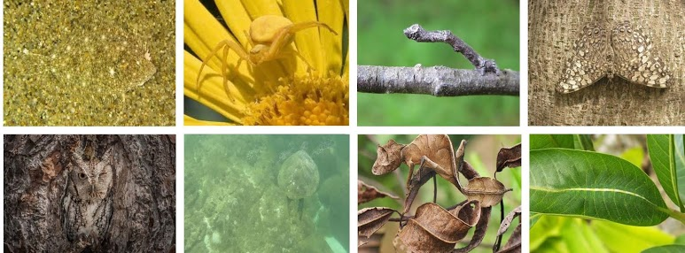

Evaluation Code for Camouflaged Object Segmentation
=====================================================================================

CAMO Dataset is downloaded from our [project page](https://sites.google.com/view/ltnghia/research/camo). 

Pre-computed results are downloaded from [here](https://sites.google.com/view/ltnghia/research/camo).

Citation
--------------

Please cite the following paper: 

    @article{ltnghia-CVIU2019,
      Title          = {Anabranch Network for Camouflaged Object Segmentation},
      Author         = {Trung-Nghia Le and Tam V. Nguyen and Zhongliang Nie and Minh-Triet Tran and Akihiro Sugimoto},
      Journal        = {Journal of Computer Vision and Image Understanding}
      Year           = {2019}
      Volume         = {184}, 
      Pages          = {45-56}, 
    }

------------------
The code is used for academic purpose only.

Contact: [Trung-Nghia Le](https://sites.google.com/view/ltnghia).
